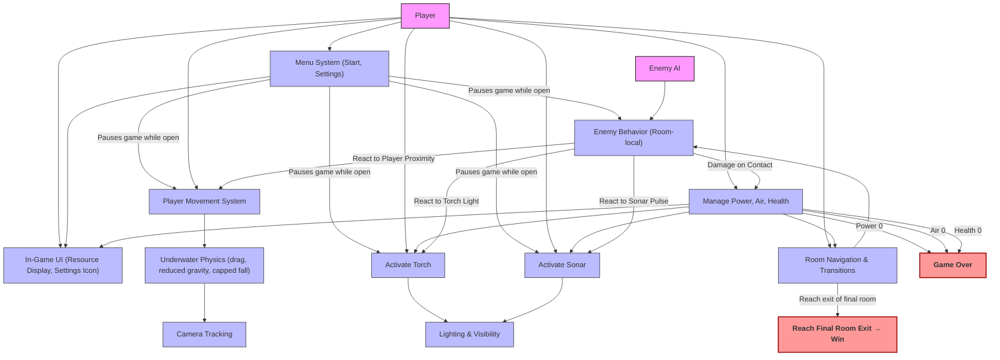

<html>
	<body style="text-align: center;">
		<div align="center">
		   <h1> University  of  Bristol <br/>
		   COMSM0166 - Group 1 (2026) <br/></h1>
		</div>
		<div align="center">
		   <h2> SONAR (working title) </h2> 
			STRAPLINE. Add an exciting one sentence description of your game here. <br/><br/>
			[ADD PROMO IMAGE]
		</div>
		<div align="center">
 			<h3 align=center><a href="https://uob-comsm0166.github.io/2026-group-1/="">Play Current Version - V2.5</a></h3>
		</div>
	</body>
</html>


### Video DEMO v2.3
*(updated 11/02/26)*

https://github.com/user-attachments/assets/7f6a8c2a-c20e-4220-b267-f1d39c76ae9f.mp4

<br/>
<br/>


# Our Team - Group 1


</br>

|Name|Email|Role|
|:-|:-|:-|
|Archie Brown|cq25988@bristol.ac.uk||
|Monal Gupta|ta25702@bristol.ac.uk|
|Ben Mounce|wv25183@bristol.ac.uk|
|Georgia Sweeny|dp25498@bristol.ac.uk|
|Nick Jankov|ve21144@bristol.ac.uk|
|Jude Hsu|ca20853@bristol.ac.uk|

</br>

### Kanban Board & Organisation

[GitHub Kanban](https://github.com/orgs/UoB-COMSM0166/projects/171/views/1) - Used track feature tracking & tickets

[Notion Kanban Page](https://www.notion.so/2eef3902b1f0803590afe2a31c236dab?v=2eef3902b1f080509478000c3aa3a4a6&source=copy_link) - Used to manage general planning, organisation, share and document research (hub)

---
</br>

# Project Report

## 1. Introduction
- 5% ~250 words 
- Describe your game, what is based on, what makes it novel? (what's the "twist"?) 

Our game is a tense, underwater exploration adventure where **players navigate their way out of abyss** using movement, resource management, and environmental interaction. The core **twist** is the 
**echolocation-based sonar mechanic**, which allows players to temporarily reveal their surroundings in an **otherwise dark** and hazardous environment. This mechanic drives both **gameplay and atmosphere**,
creating tension and encouraging strategic decision-making.

The game draws inspiration from **Metroidvania-style** design, featuring interconnected rooms, gated areas unlocked through new abilities, and challenges that reward exploration and mastery. Unlike traditional
underwater games, the use of **sonar as a primary navigation** and discovery tool sets it apart, providing a **fresh experience** where visibility is limited and deliberate planning is essential.

Players must **manage resources** such as power, air, and health while exploring unknown areas. **Strategic** use of the **torch and sonar** is crucial, as these tools consume resources but are necessary for
survival and progression. This combination of limited visibility, environmental hazards, and resource management emphasizes **careful exploration over fast-paced action**, creating an immersive and atmospheric
gameplay loop.

The game’s **novelty** lies in how the **sonar mechanic integrates with world design, enemies, and lighting**. It encourages players to think tactically, interact meaningfully with the environment, and engage with
risk versus reward. By combining a familiar exploration framework with a unique visibility mechanic, the game provides a **distinctive experience** that is both challenging and rewarding, appealing to players
seeking **depth, immersion, and discovery in an underwater setting**.

## 2. Requirements 
- 15% ~750 words
- Early stages design. Ideation process. How did you decide as a team what to develop? Use case diagrams, user stories.

### 2.1 Early Stage Design & Ideation
The game concept was developed collaboratively through group discussions and pitch proposals. Each team member suggested ideas and voted on their favourites, with two concepts centred on echolocation. 
This mechanic became the foundation, naturally inspiring an underwater exploration theme and tension through limited visibility. The team agreed that the core differentiator would be a sonar-based mechanic,
supported by darkness and resource management systems. Development was structured around Epics and user stories to align design with implementation.


### 2.2 Paper Prototypes
Paper prototyping allowed the team to experiment with core mechanics at low cost before coding. Informal playtesting and feedback identified the most engaging mechanics, with the echolocation system receiving
particularly positive responses. Testers highlighted the tension from limited visibility and sonar use, validating the mechanic and setting.

Based on this feedback, the team adopted a Metroidvania-inspired structure emphasizing exploration, gradual mastery of abilities, environmental gating, and strategic resource management. 
These elements complement the sonar mechanic by encouraging players to navigate carefully, conserve resources, and decide when to reveal their surroundings. This phase helped us refine the
game's identity, confirming that the core appeal lies in controlled exploration, atmosphere, and tension.


---
</br>

### 2.3 Stakeholders - Onion Model


---
</br>

## 2.4 Epics and User Stories

### EPIC 1 – Core Player Interaction
**Description:** The player must move, explore, and interact with the underwater world intuitively.  
**User Stories:**  
- As a competitive player, I want responsive movement, so that I feel in control underwater.
- As a player, I want to navigate vertical spaces, so that I can truly explore.
- As a casual player, I want intuitive controls, so that I can start playing immediately. 
- As a disabled player, I want remappable controls, so that I can play comfortably.
  
**Acceptance Criteria:** Movement and physics are frame-rate independent; input is separated from logic; drag and capped fall speed applied consistently.

### EPIC 2 – Resource & Survival Systems
**Description:** Players manage limited resources to create tension and strategic decision-making.  
**User Stories:**  
- As a player, I want power to drain over time, so that exploration feels risky.
- As a player, I want torch and sonar to consume additional power, so that I must choose when to use them.
- As a player, I want health to decrease when colliding with enemies, so there are tangable consequences.  
  
**Acceptance Criteria:** Resources drain continuously and predictably; Game Over triggers if any resource reaches zero; UI displays all resources clearly.

### EPIC 3 – Sonar & Lighting Identity Mechanic
**Description:** The sonar system defines the game’s identity and atmosphere.  
**User Stories:**  
- As a player, I want to activate sonar, so that hidden areas are temporarily revealed.  
- As a player, I want revealed areas to fade over time, so that tension is maintained.  
- As a player, I want the torch to provide limited visibility, so that I can navigate carefully.
  
**Acceptance Criteria:** Sonar pulse reveals environment temporarily; lighting and rendering are modular; enemy reactions vary by type.

### EPIC 4 – Enemies & Challenge
**Description:** Enemies create risk and strategic gameplay in each room.  
**User Stories:**  
- As a player, I want enemies to patrol, so that the world feels alive.  
- As a player, I want enemies to react to sonar, torch, or proximity, so that encounters feel meaningful.  
- As a casual player, I want enemy behaviour to be readable, so that I can anticipate threats.
  
**Acceptance Criteria:** Room-specific enemies with defined states; collisions reduce health; reactions vary by enemy type.

### EPIC 5 – World Structure & Progression
**Description:** The world supports exploration and progression in a Metroidvania style.  
**User Stories:**  
- As a player, I want interconnected rooms, so that exploration feels cohesive.
- As a player, I want gated paths, so that new abilities unlock new areas.
- As a player, I want the camera to follow me, so that I am immersed in large rooms.
  
**Acceptance Criteria:** 3–5 interconnected rooms; abilities unlock new areas; camera clamps to room bounds; reaching final exit triggers win state.

### EPIC 6 – Interface & Game States
**Description:** Players navigate menus and understand game states clearly.  
**User Stories:**  
- As a player, I want a start menu, so that I can begin the game intentionally.
- As a player, I want a settings menu, so that I can adjust preferences.
- As a player, I want in-game UI for resources, so that I can manage power, air, and health.
- As a non-English speaker, I want the UI to use symbols, so that I can understand it without reading.
  
**Acceptance Criteria:** Menus pause gameplay; UI shows all resources; Game Over and Win states trigger correctly.

### EPIC 7 – Technical Architecture & Maintainability
**Description:** The system remains modular and extensible for collaborative development.  
**User Stories:**  
- As a developer, I want systems to have single responsibilities, so that debugging is easier.
- As a future developer, I want to add new systems without rewriting core logic, so that development remains scalable.
- As a JavaScript developer, I want logic separated from rendering, so that advanced features like layered lighting are easier to implement.
  
**Acceptance Criteria:** Modular systems (Input, Physics, Resource, Lighting, Enemy); central engine update order; lighting separated from rendering; deltaTime used for all time-based behaviour; room and camera systems manage world scale independently.

---
</br>

### 2.5 Use Case Diagram



---
</br>

### 2.6 Prioritised Feature Breakdown
A risk-managed development approach prioritising core mechanics and technical feasibility over feature breadth.
Based on user stories derived from our game Epics

| **Priority**            | **Systems / Features**                                                   | **Estimated Implementation Time** |
| ----------------------- | ------------------------------------------------------------------------ | --------------------------------- |
| **HIGH (MVP)**          | Player controls (intents: movement, sonar ping, torch toggle)            | 1-2 days (mostly done)            |
|                         | Physics (underwater movement, drag, collisions, hitboxes)                | 4–5 days                          |
|                         | Minimal gameplay UI (power meter, sonar cooldown, pause)                 | 1–2 days                          |
|                         | Resource management (power drain + torch drain, replen)                  | 2–3 days (mostly done)            |
|                         | Lighting system (darkness overlay + visibility masking)                  | 3–5 days                          |
|                         | Echolocation / Sonar system (pulse, circular reveal, fade-out, cooldown) | 3–5 days (PoC exists)             |
|                         | Core Metroidvania structure (3–5 rooms, 1 gate, basic traversal)         | 4–6 days                          |
| **MEDIUM (Core Depth)** | Room system (room objects, transitions, bounds)                          | 3–5 days                          |
|                         | Camera system (follow player, clamp to room)                             | 2–3 days                          |
|                         | Torch visual enhancement (improved lighting radius)                      | 1–3 days                          |
|                         | Enemy system (basic patrol / contact damage)                             | 3–5 days                          |
|                         | Enemy awareness to sonar (alert state within pulse radius)               | 4–7 days                          |
|                         | Exploration ability (double jump unlock, etc.)                           | 2–4 days                          |
|                         | Simple upgrade system (increase sonar range or power capacity)           | 3–5 days                          |
| **LOW (Stretch)**       | Save system (checkpoint-based)                                           | 2–4 days                          |
|                         | Achievement system (internal milestone tracking)                         | 1–2 days                          |
|                         | Advanced enemy AI (hunt behaviour, multi-state logic)                    | 4–8 days                          |
|                         | Sonar-reactive mini-boss encounter                                       | 5–10 days                         |
|                         | Environmental physics extensions (currents, pressure zones)              | 3–6 days                          |
|                         | Public player database / leaderboard                                     | 7–14+ days                        |

---
</br>

## 3. Design

- 15% ~750 words 
- System architecture. Class diagrams, behavioural diagrams.

---
</br>
  
### 3.1 System Architecture

The project is built using a **modular, state-driven architecture** that separates **logic, rendering, input, and game world state.** Each system has a clear responsibility and communicates only via defined interfaces, which simplifies debugging, allows independent testing, and reduces unintended side-effects when new features are added.

This **high-level architecture snapshot** illustrates the responsibilities of each system:

```
InputSystem        → intent
PlayerSystem       → apply intent (movement + jump)
PhysicsSystem      → resolve motion & collisions
ResourceSystem     → manage power drain & replenishment
TorchSystem        → torch state & power usage
SonarSystem        → pulse logic & detection + alerts
RoomSystem         → current room state & transitions
CameraSystem       → viewport tracking & clamping
LightingSystem     → visibility rules & masking
EnemySystem        → AI movement & reactions
RenderSystem       → draw visible state
Engine             → orchestrates
```

**Key separation of concerns:**

- **LightingSystem** decides what is visible - **RenderSystem** decides how it is drawn.
- **CameraSystem** determines which portion of the world is in view.
- **RoomSystem** manages which data is active for the current room.

This separation ensures the game remains predictable, testable, and modular, while supporting incremental development of complex systems like sonar without destabilising rendering.

---
</br>

### 3.2 Behavioural Flow
The **Engine + Systems + Input Bridge + Render Flow** diagram shows the **per-frame execution order:**

```jsx
        ┌──────────────────────┐
        │        p5.js         │
        │   (runtime / DOM)    │
        └───────────┬──────────┘
                    │ keyPressed() / keyIsDown()
                    ▼
        ┌────────────────────-──┐
        │     Input Bridge      │  ← Lives in sketch.js
        │ (global p5 callbacks) │
        └───────────┬──────-────┘
                    │ forwards events
                    ▼
        ┌─────────────────────-─┐
        │     Input System      │
        │  - update(deltaTime)  │
        │  - onKeyPressed()     │
        │  - sets player.intent │
        └───────────┬────────-──┘
                    │
                    ▼
        ┌──────────────────────┐
        │     Player System    │
        │  - reads intent...   │
        │  - apply movement    │
        │  - jump logic        │
        └───────────┬──────────┘
                    │
                    ▼
        ┌────────────────────-──┐
        │    Physics System     │
        │  - apply gravity      │
        │  - resolve collisions │
        │  - clamp to room      │
        └───────────┬─────────-─┘
                    │
                    ▼
        ┌──────────────────────┐
        │     Resource System  │
        │  - drain power       │
        │  - handle pickups    │
        └───────────┬──────────┘
                    │
                    ▼
        ┌────────────────────---──┐
        │     Sonar System        │
        │  - drain power          |
        │  - expand pulse         │
        │  - reveal environment   │
        │  - alert nearby enemies │
        └───────────┬─────────---─┘
                    │
                    ▼
        ┌──────────────────────┐
        │     Enemy System     │
        │  - update AI         │
        │  - move enemies      │
        │  - respond to sonar  │
        └───────────┬──────────┘
                    │
                    ▼
        ┌──────────────────────┐
        │     Torch System     │
        │  - drain power       │
        │  - flicker timing    │
        │  - active state      │
        │  - exposes light     │
        └───────────┬──────────┘
                    │
                    ▼
        ┌────────────────────--──┐
        │   Lighting System      │
        │  - collects lights     │
        │  - calculates radius   │
        │  - prepares light      │
        │    data for render     │
        │  (prepare light mask)  │
        └───────────┬────────--──┘
                    │
                    ▼
        ┌────────────────────--──┐
        │     Room System        │
        │  - manage room state   │
        │  - handle transitions  │
        │  - expose active room  │
        └───────────┬───────-───-┘
                    │
                    ▼
        ┌──────────────────---────┐
        │    Camera System        │
        │  - follow player        │
        │  - clamp to active room │
        │  - compute offsets      │
        └───────────┬────────---──┘
                    │
                    ▼
        ┌───────────────────-───┐
        │     Render System     │
        │  - draw background    │
        │  - draw platforms     │
        │  - draw player        │
        │  - draw enemies       │
        │  - draw darknessLayer │
        │  - apply lights       │
        │  - draw UI            │
        └───────────┬───────-───┘
                    │
                    ▼
        ┌────────────────────-──┐
        │        Canvas         │
        │    (visual output)    │
        └───────────────────-───┘
```

**This flow demonstrates:**

- **How input is captured and translated into player intent.**
- The **ordered system updates** ensuring consistent behaviour, including movement, collisions, power/resource changes, sonar pulses, lighting calculations, and camera movement.
- **Render separation**, which keeps frame-dependent visual output isolated from game logic.


### The architecture supports:

- **Incremental development** — new systems like sonar or advanced enemy AI can be added without refactoring existing modules.

- **Modularity** — each system has a single responsibility, reducing coupling and making debugging easier.

- **Frame-rate independence** — all movement, power drain, and pulse timings use deltaTime, ensuring consistent behaviour across devices.

- **World management** — RoomSystem + CameraSystem ensures large immersive levels where the viewport follows the player without breaking modularity.

- **Lighting and visibility** — LightingSystem and RenderSystem separation allows sonar and torch light to reveal the environment correctly while keeping draw code clean.

The diagrams collectively **visualise the structure and runtime behaviour**, showing both **static responsibilities** and **dynamic per-frame interactions**. This provides clarity for team collaboration, future feature integration, and assessment of the game’s technical design.

*(wordcount for section aprox 450)*

---

### Implementation

- 15% ~750 words

- Describe implementation of your game, in particular highlighting the TWO areas of *technical challenge* in developing your game. 

### Evaluation

- 15% ~750 words

- One qualitative evaluation (of your choice) 

- One quantitative evaluation (of your choice) 

- Description of how code was tested. 

### Process 

- 15% ~750 words

- Teamwork. How did you work together, what tools and methods did you use? Did you define team roles? Reflection on how you worked together. Be honest, we want to hear about what didn't work as well as what did work, and importantly how your team adapted throughout the project.

### Conclusion

- 10% ~500 words

- Reflect on the project as a whole. Lessons learnt. Reflect on challenges. Future work, describe both immediate next steps for your current game and also what you would potentially do if you had chance to develop a sequel.

### Contribution Statement

- Provide a table of everyone's contribution, which *may* be used to weight individual grades. We expect that the contribution will be split evenly across team-members in most cases. Please let us know as soon as possible if there are any issues with teamwork as soon as they are apparent and we will do our best to help your team work harmoniously together.

### Additional Marks

You can delete this section in your own repo, it's just here for information. in addition to the marks above, we will be marking you on the following two points:

- **Quality** of report writing, presentation, use of figures and visual material (5% of report grade) 
  - Please write in a clear concise manner suitable for an interested layperson. Write as if this repo was publicly available.
- **Documentation** of code (5% of report grade)
  - Organise your code so that it could easily be picked up by another team in the future and developed further.
  - Is your repo clearly organised? Is code well commented throughout?
