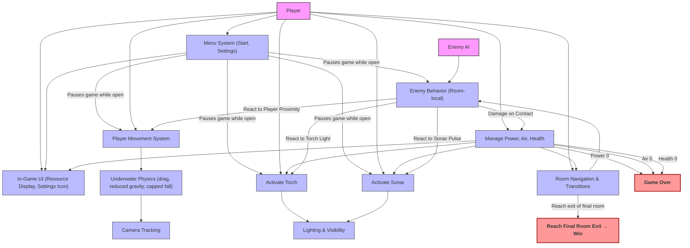

```mermaid
graph TD
    %% Actors
    Player["Player"]:::actor
    Enemy["Enemy AI"]:::actor

    %% Menu / UI Layer
    Menu["Menu System (Start, Settings)"]:::system
    UI["In-Game UI (Resource Display, Settings Icon)"]:::system
    Player --> Menu
    Player --> UI
    Menu --> UI
    Menu -->|Pauses game while open| Movement
    Menu -->|Pauses game while open| Torch
    Menu -->|Pauses game while open| Sonar
    Menu -->|Pauses game while open| Enemy_AI

    %% Gameplay Systems
    Movement["Player Movement System"]:::system
    Physics["Underwater Physics (drag, reduced gravity, capped fall)"]:::system
    Torch["Activate Torch"]:::system
    Sonar["Activate Sonar"]:::system
    Resource["Manage Power, Air, Health"]:::system
    Lighting["Lighting & Visibility"]:::system
    Room["Room Navigation & Transitions"]:::system
    Camera["Camera Tracking"]:::system
    Enemy_AI["Enemy Behavior (Room-local)"]:::system
    GameOver["Game Over"]:::critical
    Win["Reach Final Room Exit → Win"]:::critical

    %% Player interactions
    Player --> Movement
    Player --> Torch
    Player --> Sonar
    Player --> Resource
    Player --> Room

    %% Physics integration
    Movement --> Physics
    Physics --> Camera
    Torch --> Lighting
    Sonar --> Lighting
    Resource --> Torch
    Resource --> Sonar
    Resource --> Room
    Resource --> UI

    %% Enemy reactions (room-local)
    Room --> Enemy_AI
    Enemy --> Enemy_AI
    Enemy_AI -->|React to Player Proximity| Movement
    Enemy_AI -->|React to Sonar Pulse| Sonar
    Enemy_AI -->|React to Torch Light| Torch

    %% Enemy damages player
    Enemy_AI -->|Damage on Contact| Resource

    %% Resource drain → Game Over
    Resource -->|Power 0| GameOver
    Resource -->|Air 0| GameOver
    Resource -->|Health 0| GameOver

    %% Win condition
    Room -->|Reach exit of final room| Win

    %% Styling
    classDef actor fill:#f9f,stroke:#333,stroke-width:1.5px
    classDef system fill:#bbf,stroke:#333,stroke-width:1px
    classDef critical fill:#f99,stroke:#900,stroke-width:2px,font-weight:bold

```
